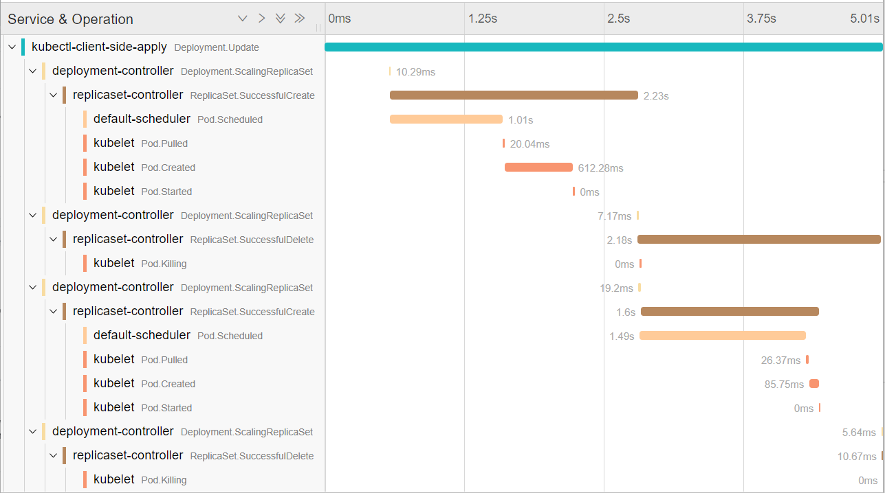

# kspan - Turning Kubernetes Events into spans

## This project is a Work In Progress, under active evolution.

Most Kubernetes components produce Events when something interesting happens.
This program turns those Events into OpenTelemetry Spans, joining them up
by causality and grouping them together into Traces.

Example: rollout of a Deployment of two Pods:



The picture was generated by `kspan` and Jaeger; it is a visualisation of the
events generated from `kubectl apply`. `kspan` has identified five different
sources of events, and has joined up the events for starting each Pod underneath
the ReplicaSet scaling operation that created it.

We start with this concrete information:
 * Each Event has an Involved Object, e.g. when Kubelet sends a "Started" event,
   the Involved Object is a Pod.
 * Every Kubernetes object can have one or more Owner References. So for instance
   we can walk from the Pod up to a Deployment that caused it to be created.

Complications:
 * We cannot expect events to arrive in the ideal order; we need to delay handling some until their "parent" arrives to make sense.

Heuristics:
 * If we recently saw an event from an owner, that probably caused this event
   in the owned object. We set the child-of relationship on the new span.
 * A couple of specific events, from ReplicationSet and StatefulSet, are reported on
   the owner but make more sense as events on the sub-object they mention.
 * An event can be marked in its annotations as the start of a trace.
 * If we have walked the owner chain up to an object with no owner, no recent event,
   then start a new trace.
   *  Trace ID is hashed from UID of this object + its generation

For future consideration:
 * We can match up resourceVersion between event and object.
   * do we need to?

To run Jaeger locally:
```
docker run -d --name jaeger -p 16686:16686 -p 55680:55680 jaegertracing/opentelemetry-all-in-one
```

## <a name="join"></a>Join in the fun!

If you have any questions about, or feedback on `kspan`:

- Invite yourself to the <a href="https://slack.weave.works/" target="_blank">Weave Users Slack</a>.
- Ask a question on the [#general](https://weave-community.slack.com/messages/general/) slack channel.
- [File an issue](https://github.com/weaveworks-experiments/kspan/issues/new).

Your feedback is always welcome!
